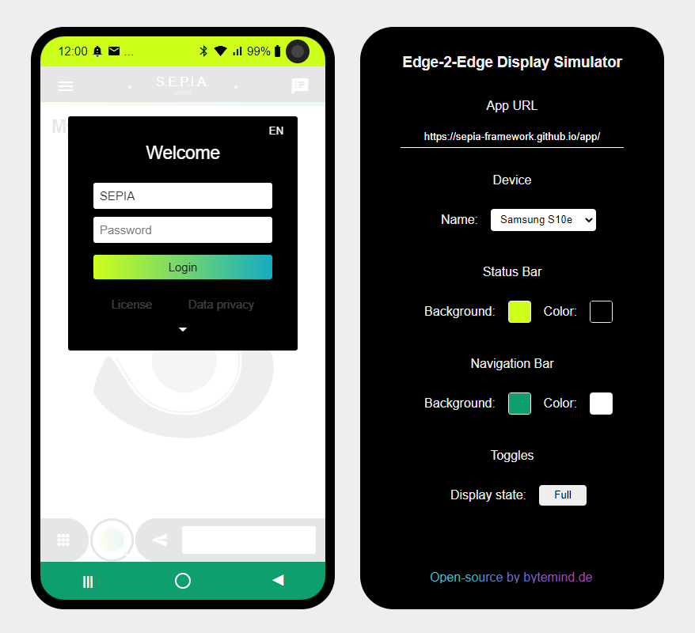

# EdgeSquare - Edge-2-Edge Display Simulator 

EdgeSquare is a web based online simulator for mobile edge-to-edge displays with notch or any other form of camera cutout. 
It can load your web-app via iframe and lets you choose from a number of devices with presets for the status bar, navigation bar, camera cutout (notches, holes, etc.) and some other properties.
In addition you can set your own colors for status bar and navigation bar to try out some design tweaks.  
  
Check out how your web application REALLY looks on modern smartphones! ;-)  
  
## Getting started

* Host the website on your server or simply go to: http://bytemind.de/tools/edge-sq/
* Enter the URL of your web application (or play around with the [SEPIA Open Assistant](https://sepia-framework.github.io/) demo, another great open-source project ^^)
* Choose a device from the selector
* Adjust colors as needed
* Discover how your website/app looks like on a modern mobile phone display

### Known issues

* Since the devices are defined by their viewport size and **not their physical size** some might appear bigger than others or identical in size when they are actually smaller (or vice versa). Nevertheless this **DOES** represent the space a website or app will have on a specific device!
* The child app (the app started via 'App URL') runs in an iframe of the parent page and therefore it might not look exactly like the mobile version. This depends on how the child app reacts to the browser 'User-Agent' and viewport scaling.
* If you need to simulate a different 'User-Agent' e.g. of a mobile browser you can use this SEPIA open-source browser extension for Chrome: [SEPIA Framework Tools](https://github.com/SEPIA-Framework/sepia-browser-extensions)
* HTML meta property 'theme-color' is ignored (in general data from inside the iframe is not handed over to the parent).

## Screenshots

  

## Licenses

This project is licensed under the MIT open-source license.
It is written in vanilla JS and includes only very few dependencies:
* [Pickr](https://github.com/Simonwep/pickr) - Color picker that works cross-browser - MIT license
* [SVG-Inject](https://github.com/iconfu/svg-inject) - Tool to create styleable SVG images - MIT license
* Web fonts from [Google Material Icons](https://material.io/resources/icons/) - Apache license version 2.0
* Some SVG icons from [Simple Icons](https://simpleicons.org/) project - CC0 1.0 Universal license